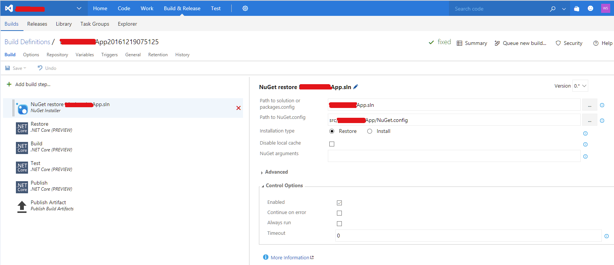

# How to setup Private NuGet feed for Azure

The following instructions will enable you to do add a private NuGet feed when running MSBuild on a Build machine such as hosted by Azure.

1. Add NuGet.config to WebApp project in Visual Studio

2. Add new item NuGet.config to same directory as project.json and edit as below, setting your own username and password (in clear text) as needed to logon to the Telerik site:

        <?xml version="1.0" encoding="utf-8"?>
        <configuration>
            <packageSources>
                <add key="Telerik" value="https://nuget.telerik.com/nuget/" />
            </packageSources>
            <packageSourceCredentials>
            <Telerik>
                <add key="Username" value="user.name@telerik.com" />
                <add key="ClearTextPassword" value="********" />
            </Telerik>
            </packageSourceCredentials>
        </configuration>

3. Edit Build Definition to add step for NuGet installer - In Visual Studio 
   1. select Team Explorer, Builds
   1. select Build Definition, right click | Edit Build Definition. This opens the Build Definition in your browser - see attached screen shot 

4. In Build Definition editor add build step = Nuget Installer, drag/drop to top of list and specify the solution file as well as the NugGet.config

5. Save

6. Save your changes to source control for the WebApp in Visual Studio - i.e. the Build Definition and NuGet.config

7. Queue a New Build